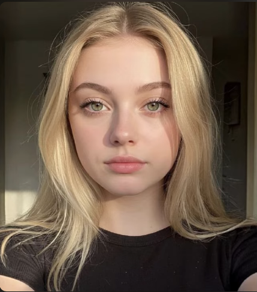
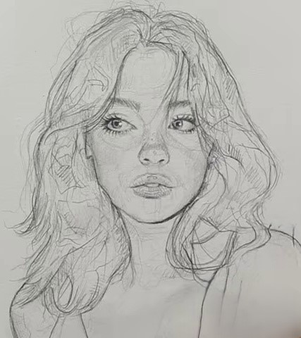
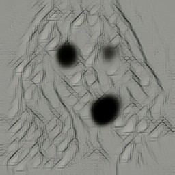
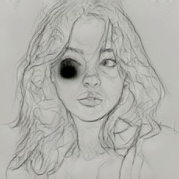

# NST Studio

<div align="center">


**A full-stack Neural Style Transfer application with a modern web UI.**  
Supports **Classic NST** (Gatys et al. 2015) for any style image, and **Fast NST** (Johnson et al. 2016) for instant inference using a trained feed-forward network.

</div>

---

## Results

### Pencil Sketch Style Transfer

| Content Image | Style Reference | Stylized Output |
|:---:|:---:|:---:|
|  |  |  |

### Training Progression (every 500 steps)

The model learns progressively over 20,500 steps on MS-COCO train2014:

| Step 500 | Step 5,000 | Step 10,000 | Step 20,500 |
|:---:|:---:|:---:|:---:|
|  |  |  |  |

---

## Features

### Classic NST
- Iterative pixel optimisation using frozen VGG-19
- Adjustable iterations, style strength, and content fidelity
- Real-time progress via Server-Sent Events (SSE)
- Any style image — no training required

### Fast NST
- Feed-forward TransformerNet — stylization in **under 1 second**
- **8 quality improvements** over the baseline Johnson 2016 model:
  - 5-layer VGG style loss (relu1\_2 → relu5\_3)
  - Multi-scale Gram matrices (3 scales averaged)
  - Feature statistics loss (per-channel mean + std matching)
  - Identity loss — `net(style) ≈ style`
  - Per-layer style weights
  - LR warmup + cosine annealing
  - Mixed precision (AMP) with float32 VGG guard
  - **PatchGAN adversarial loss** — 70×70 discriminator enforces micro-texture realism
- Post-processing: automatic removal of stuck-neuron artifacts

### Web UI
- Drag-and-drop image upload
- Before/After comparison slider (CSS clip-path)
- Results gallery with fullscreen viewer
- Training sample previews per model
- Live loss display during Classic NST
- Toast notifications

---

## Architecture

```
┌─────────────────────────────────────────────────────┐
│  Browser (HTML + CSS + JS)                          │
│  Drag-drop upload · Comparison slider · Gallery     │
└─────────────────────────┬───────────────────────────┘
                          │ HTTP / SSE
┌─────────────────────────▼───────────────────────────┐
│  Flask  app.py                                      │
│  /upload   /progress/<id>   /fast-stylize           │
│  /models   /gallery         /sample-img/<m>/<f>     │
└────────────┬────────────────────────┬───────────────┘
             │                        │
┌────────────▼──────────┐  ┌──────────▼──────────────┐
│  nst_core.py          │  │  fast_nst.py             │
│  Classic NST          │  │  Feed-forward inference  │
│  VGG-19 optimisation  │  │  TransformerNet          │
└───────────────────────┘  └──────────────────────────┘
```

---

## Quick Start

```bash
# 1. Clone
git clone https://github.com/charbelmezeraani0-star/neural-style-transfer.git
cd neural-style-transfer

# 2. Install dependencies
pip install -r requirements.txt

# 3. Start the web app
python app.py

# 4. Open browser
# http://localhost:5000
```

The `pencil_sketch` model is included — Fast NST works immediately after install.

---

## Training a New Style Model

### 1. Download MS-COCO train2014

Get the dataset (~13 GB) from [cocodataset.org](https://cocodataset.org/#download) and place the zip in `~/Downloads/`.

### 2. Add your style image

Drop any `.jpg` or `.png` into `NST/images/styles/`.

### 3. Train

```bash
bash start_training.sh
```

This will:
1. Unzip the dataset (first run only)
2. Validate all images and write a manifest (first run only, ~2 min)
3. Train the model for 2 epochs (~4–5 hrs on RTX 4050)
4. Save sample previews every 500 steps to `samples/<model>/`
5. Log loss curves to TensorBoard under `runs/`

**Monitor training:**
```bash
# Live loss curves
tensorboard --logdir runs

# Sample previews (appear every 500 steps)
ls samples/pencil_sketch/
```

**Resume after interruption:**
```bash
bash start_training.sh --resume
```

**Train all styles at once:**
```bash
bash train_all_styles.sh
```

---

## Training Hyperparameters

| Flag | Default | Effect |
|------|---------|--------|
| `--epochs` | 2 | More epochs = better texture, diminishing returns after 6 |
| `--batch-size` | 8 | Increase if VRAM allows |
| `--image-size` | 256 | 288–320 for higher quality; slower per step |
| `--style-weight` | 1e10 | Higher = more stylized, less content |
| `--content-weight` | 1e5 | Higher = more faithful to content |
| `--stats-weight` | 1e6 | Feature statistics matching strength |
| `--adv-weight` | 1e4 | PatchGAN loss; raise to 5e4 for sharper textures |
| `--tv-weight` | 1e-6 | Total variation smoothness |
| `--sample-every` | 500 | Steps between saved preview images |

---

## Project Structure

```
ml project/
├── app.py                Flask web server
├── nst_core.py           Classic NST engine (VGG-19 optimisation)
├── fast_nst.py           Fast NST inference + artifact post-processing
├── train.py              Fast NST training script
├── transformer_net.py    TransformerNet + PatchDiscriminator
├── preprocess.py         Dataset validation & manifest generation
├── start_training.sh     One-command training launcher
├── train_all_styles.sh   Train all styles in NST/images/styles/
├── make_presentation.py  Generates the PowerPoint presentation
├── requirements.txt
├── models/
│   └── pencil_sketch.pth       Trained model (included)
├── samples/
│   └── pencil_sketch/          Training preview images
├── NST/images/
│   ├── styles/                 Style images for training
│   └── content/                Content images for testing
├── templates/
│   └── index.html
└── static/
    ├── css/style.css
    └── js/app.js
```

---

## Key Technical Notes

**VGG float16 overflow fix:**  
When using AMP (mixed precision), VGG-19 activations at `relu4_3` and `relu5_3` regularly exceed the float16 maximum (~65504), producing `inf` losses. The fix: run VGG entirely in float32 outside the autocast context.

```python
# CORRECT — VGG in float32, outside autocast
feat_out = vgg(stylized.float())
feat_in  = vgg(batch.float())

# WRONG — causes inf style loss
with torch.amp.autocast(...):
    feat_out = vgg(stylized)   # float16 → overflow at deep layers
```

**Artifact removal:**  
A stuck neuron in TransformerNet can produce a small dark cluster. `fast_nst.py` detects pixels that are anomalously dark relative to their surroundings (isolated dark artifact) and replaces them with the local median.

---

## References

- Gatys, L. A., Ecker, A. S., & Bethge, M. (2016). [A Neural Algorithm of Artistic Style](https://arxiv.org/abs/1508.06576)
- Johnson, J., Alahi, A., & Fei-Fei, L. (2016). [Perceptual Losses for Real-Time Style Transfer](https://arxiv.org/abs/1603.08155)
- Isola, P., et al. (2017). [Image-to-Image Translation with Conditional Adversarial Networks](https://arxiv.org/abs/1611.07004) (PatchGAN)
- Ulyanov, D., et al. (2017). [Instance Normalization: The Missing Ingredient for Fast Stylization](https://arxiv.org/abs/1607.08022)

---

## License

MIT
